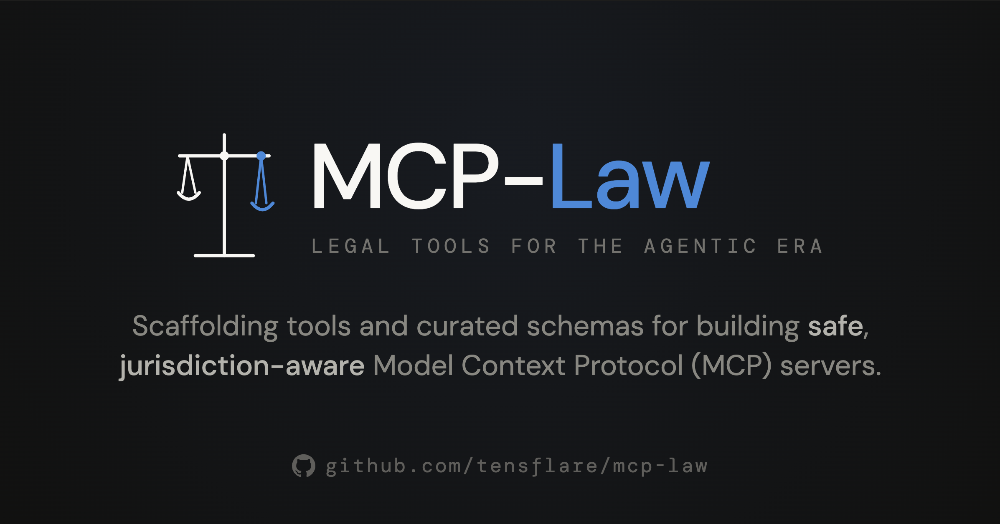

# MCP-Law ⚖️

**Legal Tools for the Agentic Era**

<div align="center">
  
</div>

[](https://www.npmjs.com/package/@tensflare/mcp-law)
[](LICENSE)
[](https://github.com/tensflare/mcp-law/actions/workflows/ci.yml)
[](package.json)

Scaffolding tools and curated schemas for building **safe, jurisdiction-aware** [Model Context Protocol (MCP)](https://modelcontextprotocol.io) servers for legal use cases.

---

## Features

- **CLI Scaffolding** — Generate production-ready MCP server projects in seconds with `npx @tensflare/mcp-law init`
- **Curated Registry** — Discover and validate legal MCP servers across jurisdictions and practice areas
- **Jurisdiction Schemas** — Built-in data for 10+ jurisdictions with citation format validation
- **Contract Analysis** — Clause extraction patterns, risk flags, and compliance checks for 14 clause types
- **Security Middleware** — Audit logging, permission scoping, rate limiting, and input validation
- **Dual Transport** — Servers run over stdio (local) or HTTP/SSE (remote)

---

## Quick Start

```bash
npx @tensflare/mcp-law init my-legal-server
cd my-legal-server
npm install
npm run dev
```

Then connect your MCP client to the server via stdio.

---

## CLI Reference

| Command | Description |
|---------|-------------|
| `mcp-law init [name]` | Scaffold a new legal MCP server project |
| `mcp-law list` | List all known legal MCP servers |
| `mcp-law search <query>` | Search the legal MCP server registry |
| `mcp-law validate <path>` | Validate an MCP server configuration file |
| `mcp-law info <code>` | Get jurisdiction information |

### Interactive Mode

```bash
mcp-law init
```

### Non-Interactive Mode

```bash
mcp-law init my-server --template jurisdiction-aware --jurisdiction US UK EU --tools get_jurisdiction_info validate_citation
```

---

## Templates

| Template | Description |
|----------|-------------|
| `basic` | Minimal MCP server with a single greet tool — ideal for getting started |
| `jurisdiction-aware` | Tools filtered by jurisdiction, citation validation, legal metadata |
| `contract-analysis` | Clause extraction, risk scoring, compliance checking |

---

## Registry

Browse the curated registry of legal MCP servers:

```bash
mcp-law list
mcp-law search contracts --jurisdiction US --domain contracts
mcp-law validate ./my-server-config.json
```

---

## Jurisdictions

Built-in support for 10 jurisdictions with legal system metadata, citation format validation, and court hierarchy:

- **US** — United States (Federal)
- **US-CA** — California (US State)
- **UK** — United Kingdom
- **EU** — European Union
- **AU** — Australia
- **SG** — Singapore
- **IN** — India
- **CA** — Canada (Federal)
- **DE** — Germany
- **FR** — France

---

## Development

```bash
npm install
npm run build
npm test
npm run dev
```

---

## Contributing

See [CONTRIBUTING.md](CONTRIBUTING.md). All contributions welcome!

## License

Apache 2.0 — see [LICENSE](LICENSE).
